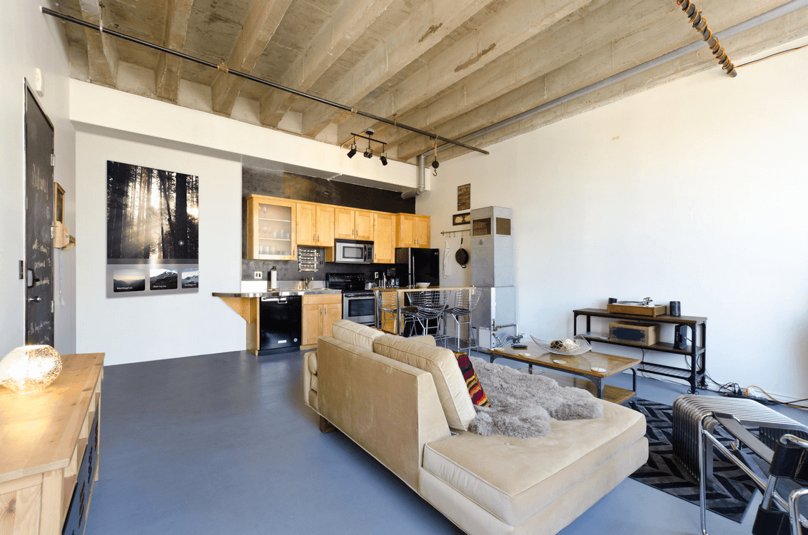

# Okno

An open window to the outside.

A product designed and prototyped by the Tatibah group during the first [HackInTime](https://twitter.com/hashtag/hackintime).

## Problematic

Nowadays, houses are a safe haven. But this could mean withdrawal and isolation.

## Solution

Okno is a digital window composed of a screen and many sensors.
While idle, it could display relaxing background of feed from a webcam anywhere in the world.

The user can use it to create a real connexion with someone else. Two Okno could be paired and act as portal between faraway places.

### Our goal

 - Add more communication inside houses - Okno can act as a wide range of communication form
 - Reduce the number of devices and remotes - Okno can manage the whole house demotic
 - Allow for interior personalisation - Okno can display different view (webcam, virtual world, 3D scene ...)

